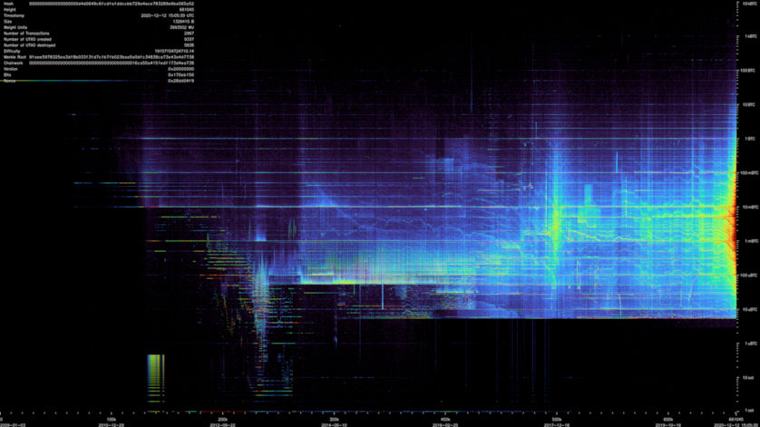

# BitcoinUtxoVisualizer

BitcoinUtxoVisualizer (short `buv`) can generated videos of the evolution of the evolution of Bitcoin's [UTXO (Unspent Transaction Outputs)](https://medium.com/bitbees/what-the-heck-is-utxo-ca68f2651819).

The output looks like this (click for high resolution 4k image):

[](https://raw.githubusercontent.com/martinus/BitcoinUtxoVisualizer/master/doc/img_0661045_compressed.png)

# Installation

```
# fetch
git clone --recurse-submodules https://github.com/martinus/BitcoinUtxoVisualizer.git

# compile
mkdir BitcoinUtxoVisualizer/build
cd BitcoinUtxoVisualizer/build
cmake -DCMAKE_BUILD_TYPE=Release ..
make

# run all tests


# How To Generate a UTXO Movie

**WARNING**: Generating such a video is a time and resource intensive task, as Bitcoin's database is continuously growing.


Having said that, generating a video is a 3 step process:

## Bitcoin Core

1. Have a fully synced [Bitcoin Core](https://bitcoin.org/en/bitcoin-core/) node running locally.
1. Make sure to enable transaction index by adding `txindex=1` to `bitcoin.conf`.
1. `buv` makes heavy use of Bitcoin Core's JSON RPC, so you need to enable this as well. Also, make sure the
   RPCs have enough threads for processing. To sum this up, I have these settings in my `bitcoin.conf` file:
   ```
   server=1
   rest=1
   rpcport=8332
   rpcthreads=32
   rpcworkqueue=64
   txindex=1
   dbcache=2000

   # generate username & password with 'bitcoin/share/rpcauth.py <username> -'
   rpcauth=martinus:xxxxxxxxxxxxxxxxxxxxxxxxxxxxxxxxxxxxxxxxxxxxxxxxxxxxxxxxx
   ```

## Preprocess UTXO Data


Once Bitcoin Core is fully synced and RPC is enabled, you can preprocess the UTXO database. This fetches all blocks with full transaction data from bitcoin core, extracts UTXO data, and writes a compact data file:

```


Parses the whole blockchain with the use of 
[Bitcoin's REST interface](https://github.com/bitcoin/bitcoin/blob/master/doc/REST-interface.md).

It can be used to generate a video of the evolution of the UTXO.

The most recent (and largest) video that I've done is this: https://www.youtube.com/watch?v=sT_SOEc_U_A

It also flashes the transactions of the latest block as white dots (so basically the UTXO's from the past that are removed)

The basic workflow is like this:

1. Make sure [bitcoind](https://bitcoin.org/en/bitcoin-core/) is running, with RPC enabled, and with `txindex=1` enabled. I have these settings in my `bitcoin.conf`:
   ```
   server=1
   rest=1
   rpcport=8332
   txindex=1
   dbcache=8000
   # generate username & password with 'bitcoin/share/rpcauth.py <username> -'
   rpcauth=martinus:xxxxxxxxxxxxxxxxxxxxxxxxxxxxxxxxxxxxxxxxxxxxxxxxx
   ```

1. First, fetch data from bitcoin full node (using the JSON interface), and preprocess this into a binary data dump. This is done with `utxo_to_change.rb`. It is a timeconsuming process. Could probably be optimized by using a different API or directly operating on the binary data.

1. After generating the binary dump, an C++ generator (BitcoinVisualizer) parses the dump and generates images that can be directly piped into `ffmpeg` which generates a video. Most of the magic is done in the class `Density`. This creates a socket connection, and dumps each image it generates from the binary data into the socket for `ffmpeg` to process. Note that currently it's hardcoded to stop at block 200000. Instead of `ffmpeg` you can also dump the images into `ffplay` to directly visualize the output.

Currently the C++ code is a bit platform specific unfortunately, and not well documented.
